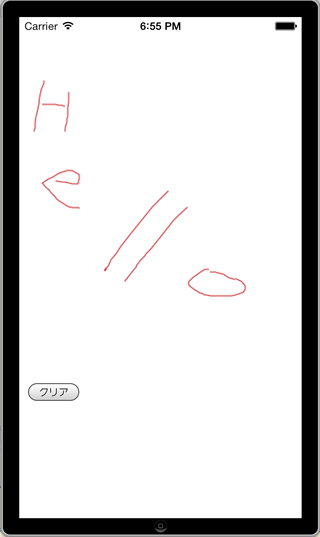

About
------
Titanium Alloy 用の サインを手書きでかけるようにする View Widget です。



Usage
------
Copy the `widgets` folder in `app/widgets` folder of your project.

### View ###
#### app/views/index.xml ####
```xml
<Alloy>
  <Window>
    <Widget src="jp.co.mountposition.signview" onChange="signChange" />
  </Window>
</Alloy>
```

### Controller ###
#### app/controllers/index.js ####
```javascript
function signChange(e) {
  var imageView = Ti.UI.createImageView({image: e.data});
  $.index.add(imageView);
}
```

### config.json ###
Add dependencies of `app/config.json`

```json
{
    "global": {},
    "env:development": {},
    "env:test": {},
    "env:production": {},
    "os:ios": {},
    "os:android": {},
    "dependencies": {
        "jp.co.mountposition.signview": "1.0"
    }
}
```


License
----------
Written by [@hamasyou](https://twitter.com/hamasyou/)
Copyright &copy; 2013 MountPosition Inc.
Licensed under the [MIT License][MIT]
[MIT]: http://www.opensource.org/licenses/mit-license.php

